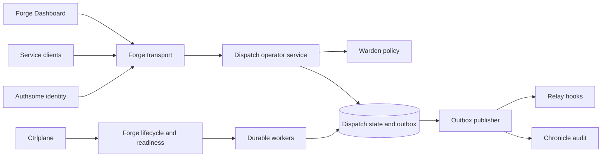
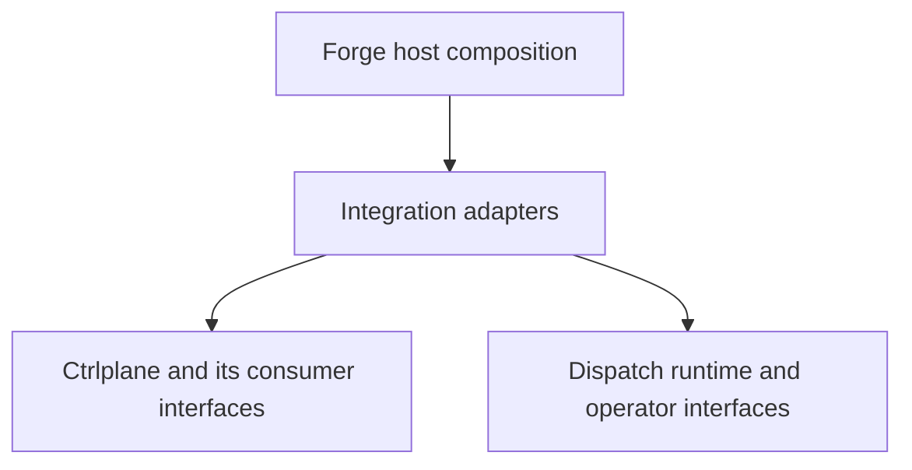

# Durable execution in the Forge ecosystem

Review date: 2026-10-09. Status: implementation authorized for the full ecosystem
program. The first slice secures existing remote operators and configures durable
Forge workers. Production and ecosystem qualification remain pending.

Dispatch should own execution history, deterministic decisions, task leases,
receipts and recovery semantics. Forge hosts it. Authsome establishes identity,
Warden decides access, Ctrlplane manages deployments, Relay delivers hooks, and
Chronicle stores audit records. You should be able to operate durable workflows
through the existing Forge dashboard without configuring a second identity or
deployment system.

The durable core has substantial memory and PostgreSQL coverage. The surrounding
operator and deployment integrations are incomplete. Several gaps affect existing
surfaces too, so the first delivery should secure those surfaces before adding
durable commands.

## Reviewed source

This review inspected local source at the following revisions. It did not launch
the combined ecosystem or test a deployed environment.

| Repository | Revision | Scope of inspection |
| --- | --- | --- |
| Dispatch | `2c6fdd6` | Durable store/runtime, engine, Forge extension, contracts, hooks, CI and recorded qualification |
| Forge | `12d86b28` | Dashboard identity middleware, predicates, Warden delegates, audit and HTTP transport |
| Forge Dashboard | `0a56090` | Dispatch routes, shared empty states and plugin playbook |
| Authsome | `4d0443e2` | Dashboard identity adapters, Warden and Chronicle injection, service authorization |
| Warden | `7ffb756` | Check API and its own fail-closed dashboard delegate |
| Relay | `4d7b9c8` | Event persistence, deduplication, delivery fanout and Dispatch bridge |
| Chronicle | `f68aaee` | Emitter, record identity, PostgreSQL append and protection configuration |
| Ctrlplane | `f98ccc9` | Provider capabilities, deployment strategies, auth abstraction and dashboard gates |

Chronicle's local branch was two commits behind its local origin reference.
Sibling checkouts contained unrelated untracked files; none were changed.
These snapshots establish available integration points, not released-version
compatibility. The assembled qualification environment must use pinned modules
and record its own versions.

## Current assessment

| Area | Present | Remaining work |
| --- | --- | --- |
| Authorized operator APIs | Forge contributor and transport; trusted durable Go methods; Warden delegate mechanism | Gate existing Dispatch intents; resolve authorized namespaces; expose durable reads and commands through one authorized service |
| React pages | Existing Dispatch plugin, lazy routes, cursor and polling helpers; shared ZeroState | Durable executions, history, tasks, run chains and authorized controls; real HTTP and browser qualification |
| Deployment compatibility | Forge lifecycle; engine build pinning; Ctrlplane provider/deployment services | Durable extension configuration, worker-aware readiness, drain and version-retirement protocol, migration compatibility |
| Security | Authsome identity and mandatory Warden/Chronicle integration in its server extension | Dispatch resource policies, service identities, callback authorization, payload permissions, denial audit and security tests |
| Load | Bounded runtime options and existing store/runtime correctness tests | Reproducible workload profiles, sustainable throughput and tail latency, fairness, admission control and soak evidence |
| Recovery | Durable receipts, fenced claims, run chains and PostgreSQL recovery-oriented tests | Separate-process kill tests, database failover, backup restore, external-effect reconciliation and measured RPO/RTO |

The preceding run-chain checkpoint passed root tests, focused race tests and the
PostgreSQL durable integration race suite. That is recorded qualification of the
core, not evidence that Authsome, Warden, Relay, Chronicle, Ctrlplane or React have
been qualified together. See [durable execution](durable-execution.md) and
[run chains](durable-run-chains.md).

## Findings that affect the plan

### 1. Existing contract capabilities do not establish authorization

[Dispatch's manifest](../../extension/contract/manifest.yaml) declares read/write
capabilities but no `requires` predicates or Warden delegates. Its
[handler wrapper](../../extension/contract/handler.go) sets timeouts and carries
the actor to hooks. It does not authorize the actor.

Forge's [identity middleware](https://github.com/xraph/forge/blob/12d86b28/extensions/dashboard/auth/middleware.go)
only populates context. Empty predicates allow, and the
[transport](https://github.com/xraph/forge/blob/12d86b28/extensions/dashboard/contract/transport/http.go)
calls Warden only when an intent declares a delegate. The stock Dispatch contract
path therefore has no per-intent identity/resource gate. A deployment can add an
upstream gate, but this review did not establish that any deployed host has one.
CSRF and idempotency checks are separate protections and do not supply permission.

Authsome's [dashboard adapter](https://github.com/xraph/authsome/blob/4d0443e2/extension/dashboard_auth.go)
returns identity fields without roles, scopes or namespace grants. Resolve
membership and policy through the server, or extend the shared identity adapter
with validated claims. Never turn a missing claim into unrestricted access.
Warden's own [contract delegate](https://github.com/xraph/warden/blob/7ffb756/extension/contract/authz.go)
provides an existing fail-closed pattern.

The transport passes `params` to the Warden delegate while typed commands can
carry their target in `payload`. Authorize the decoded target in the shared
operator service too. A harmless namespace in `params` must never authorize a
different namespace in `payload`. Review REST and DWP alongside the contract
endpoint so protection cannot be bypassed through another enabled transport.

### 2. The Forge extension does not yet configure the durable engine

The [engine](../../engine/durable.go) supports `WithDurableWorkflows`, but the
[extension's engine construction](../../extension/extension.go) does not supply
that option, and its current options/configuration expose no durable registration
path. This needs a real Forge configuration and handler-registration integration.

There is also a health mismatch: `Engine.Health` reports durable-worker errors,
while `Extension.Health` directly pings storage. A healthy database can therefore
mask a stopped durable worker on the extension health path. Wire this correctly
before Ctrlplane uses the result for deployment decisions.

### 3. Hooks need durable acceptance on both sides

The [current Relay bridge](../../relay_hook/extension.go) emits legacy lifecycle
and operator events without a stable idempotency key. The
[extension registry](../../ext/registry.go) logs hook failures and continues.
That is insufficient for a required durable notification.

Relay's [Send implementation](https://github.com/xraph/relay/blob/4d7b9c8/relay.go)
persists an event, resolves endpoints, then enqueues deliveries. A duplicate event
key returns success before fanout. If endpoint resolution or delivery enqueue
fails after event persistence, retrying the same key can report success while
deliveries remain absent. This is a source-derived failure scenario, not a fault
injection result from this review.

The proposal requires both a Dispatch transactional outbox and recoverable Relay
acceptance/fanout. Adding a Dispatch retry loop alone would leave this gap intact.

### 4. Generic dashboard audit is not a Chronicle commit receipt

Forge currently records dashboard command audit through a logger and in-memory
recording store. Its emitter returns no error, runs after dispatch and is skipped
by earlier authorization denials. It cannot prove that an accepted state change
has a durable Chronicle record.

Authsome's [Forge extension](https://github.com/xraph/authsome/blob/4d0443e2/extension/extension.go)
already requires Chronicle and Warden. Reuse that composition pattern for the
secured Dispatch operator surface. Chronicle exposes an error-returning
[Emitter](https://github.com/xraph/chronicle/blob/f68aaee/emitter.go), and its
PostgreSQL append updates the event and stream head transactionally. However,
`Record` is not an idempotent ingestion contract: a repeated supplied event ID can
hit the event insert constraint. Lost-ack recovery needs an explicit receipt or
verified lookup contract before an outbox can mark that delivery complete.

Chronicle defaults to an unkeyed digest with checkpoints disabled in its extension
configuration. The production profile must explicitly configure the selected
protection level and report coverage per stream/record. Do not describe a default
unkeyed chain as tamper resistant.

### 5. Build pinning needs deployment-aware retirement

The durable worker is pinned to namespace, queue and build. Ctrlplane already
owns provider operations and release rollback. Its
[rolling](https://github.com/xraph/ctrlplane/blob/f98ccc9/deploy/strategies/rolling.go)
strategy delegates replacement to the provider, and its
[canary](https://github.com/xraph/ctrlplane/blob/f98ccc9/deploy/strategies/canary.go)
strategy advances one service at a time. Neither inspected strategy consults
Dispatch's unfinished runs before removing an old worker build.

Use Ctrlplane to retain multiple immutable worker versions, with retirement
eligibility supplied by Dispatch. Empty active-task counts are insufficient:
sleeping executions, deferred callbacks and continued/retried runs can still
require the build. Historical queries also need a compatible reconstruction path.
Temporal's [worker versioning model](https://docs.temporal.io/production-deployment/worker-deployments/worker-versioning)
is a useful reference for keeping pinned executions on available versions while
older deployments drain. This is a design reference, not a compatibility claim.

## Proposed integration design

Start with a Forge-hosted operator and worker composition over PostgreSQL. Keep
the core packages usable through injected interfaces; resolve ecosystem services
at the Forge extension boundary. A production operator mount fails closed when
identity, authorization or durable audit acceptance is unavailable. Test-only
memory composition remains explicit.

There are two reasonable deployment shapes. Embedding workers in a Forge app
gives us the smallest integration surface and shared lifecycle. Dedicated
Forge-hosted worker services managed by Ctrlplane isolate capacity and releases,
but add service credentials, routing and deployment coordination. Support the
embedded shape first, then qualify the dedicated shape with the same operator
service and policies. Both use the same ecosystem services.

### Dependency direction and recovery independence

Ctrlplane's reviewed `main` currently constructs its own periodic
[worker scheduler](https://github.com/xraph/ctrlplane/blob/f98ccc9/worker/scheduler.go)
in [app/controlplane.go](https://github.com/xraph/ctrlplane/blob/f98ccc9/app/controlplane.go).
Its `github.com/xraph/ctrlplane/dispatch` package routes deployment sources to
providers. It is separate from `github.com/xraph/dispatch`. The resolved module
lists at review time contain neither a Ctrlplane dependency on Dispatch nor a
Dispatch dependency on Ctrlplane.

Ctrlplane may use Dispatch for durable background operations in the proposed
integration. That must not introduce reverse imports, constructor cycles or a
recovery path that requires the worker pool it is trying to recover.

Put the integration adapter in the Forge host application. It can import both
libraries, implement narrow interfaces owned by the consumer, and inject those
implementations when composing extensions. Keep both core modules independent.
If the adapter later needs reuse across hosts, extract it to an integration
module that depends on both libraries; neither core imports that module.

This diagram shows package dependencies, unlike the runtime-call diagram above:

| Consumer need | Interface ownership | Adapter responsibility |
| --- | --- | --- |
| Ctrlplane submits durable background operations | Ctrlplane owns a narrow execution interface with its own request/result types | Translate to Dispatch starts, signals and authorized status reads; register operation handlers in host composition |
| Ctrlplane needs worker status, drain or build-retirement evidence | Ctrlplane owns the lifecycle inspection/control interface it consumes | Call Dispatch's Forge-hosted operator service; preserve identity, namespace and observed revision |
| Dispatch reports execution readiness and compatible builds | Dispatch exposes execution facts through its existing engine/extension boundary | Supply those facts to Ctrlplane without importing Ctrlplane deployment types into Dispatch |
| The dashboard opens deployment controls | Each contributor owns its own contracts | Navigate to Ctrlplane through shared dashboard routing; authorize deployment actions on the Ctrlplane backend |

These interfaces are proposed work, not APIs already present. Use existing Forge
lifecycle interfaces where they fit. Keep domain request types, concrete engines
and constructors out of a shared foundation package. Returning the other
library's concrete types from an interface would reintroduce the dependency the
adapter is meant to remove. A remote adapter uses versioned wire contracts and
Authsome/Warden service authorization with the same boundaries.

The runtime recovery requirement is separate. Ctrlplane's minimum bootstrap,
worker provisioning, health and recovery controllers must remain runnable while
the managed Dispatch pool is unavailable. Keep that small controller path under
Forge/Ctrlplane lifecycle control with durable desired state and appropriate
coordination. Longer-running Ctrlplane operations can use Dispatch. A separate
queue in the same unavailable worker fleet is not an independent recovery path.

Likewise, the required audit/hook outbox publisher must be able to drain pending
intents without submitting itself to the managed Dispatch pool. Its storage and
sink dependencies remain explicit. This does not promise progress during a
database outage; it removes a dependency on workers that the publisher helps
operators diagnose and recover.

Construct and inject interfaces before starting consumers. Start the independent
infrastructure and controller services before admitting Dispatch work. During
shutdown, quiesce submissions and drain workers while the controller and required
dependencies remain available, then stop those dependencies within bounded
deadlines. No Dispatch constructor or startup hook resolves or starts Ctrlplane.

Add package/module dependency checks and an assembled-host startup test when
implementing the adapters. Build each module independently with `GOWORK=off` and
released dependency pins, then build the composed host. Check for forbidden
cross-imports and mutual module requirements explicitly. Finally, stop the
managed Dispatch workers and prove that Ctrlplane can inspect, provision and
recover them without scheduling a job on those workers.

### Identity and permissions

Persist an explicit mapping from a durable namespace to its Forge app/tenant
ownership. A namespace is an execution partition, so do not assume its string is
an organization ID. Operator-wide navigation means the caller's authorized set
of namespaces, with an explicit global grant for cross-tenant administration.
List filtering must happen before paging, counting and cursor creation.

Proposed Warden actions, with final resource names fixed in the first slice:

| Action group | Permission boundary |
| --- | --- |
| Discover/list execution metadata | Authorized namespace set |
| Read execution/history/task metadata | Namespace and persisted execution identity |
| Read payloads and run workflow queries | Separate permission from metadata inspection |
| Start, signal, signal-with-start | Explicit action and workflow type/target; signal-with-start checks both relevant permissions |
| Request cancellation | Explicit target and cancel action; acceptance is not terminal cancellation |
| Complete/heartbeat an async activity | Authsome service identity, Warden resource grant and existing attempt/secret proof |
| View audit or hook deliveries | Respective Chronicle/Relay permission plus Dispatch correlation scope |
| Deploy/scale/retire workers | Ctrlplane authorization plus Dispatch compatibility preconditions |

Missing identity, malformed scope, unknown action and policy errors deny. Treat
service identities separately from human users; an absent human identity is never
permission for a public call. Request IDs and callback secrets are not identities.
Reauthorize receipt reads and retries before returning previously accepted data.
Policy obligations such as step-up authentication must be enforced by the caller,
not merely logged after an allowed Warden result.

### Durable audit and hooks

For each required accepted command, persist the state transition, receipt and
audit/hook delivery intent in the same Dispatch transaction. Publish through
separate retryable consumers to Chronicle and Relay. Sink downtime leaves a
visible pending delivery; failure to persist the required local audit intent
rejects the mutation. This avoids making workflow progress depend on a remote
sink's latency while preserving the fact that an audit record is still pending.

Use stable delivery identities containing source deployment identity, namespace,
workflow, run, event sequence or command receipt, destination and schema version.
Relay's event key index is global, so namespace-only keys are insufficient across
independent Dispatch installations. Persist scope and actor metadata in the
outbox; a background publisher cannot reconstruct the original request context.

Record actor type/ID, trusted app/tenant, target, action, outcome, correlation,
request identity and policy decision. Omit callback secrets and workflow payloads
by default. Keep workflow history, security audit and hook delivery status
distinct. Each serves a different recovery or review purpose.

Denied attempts and sensitive reads need a Forge/security audit path even when
no execution exists. Give that path bounded durable acceptance and explicit
failure reporting. A denied request stays denied if auditing fails. Do not
recursively turn an audit delivery failure into unlimited new audit events.

### Operator contracts and React

Add ordered execution and task discovery to a dedicated durable read capability;
the current `durable.Store` exposes individual lookups and history pages but no
general execution/task listing. Define stable cursors bound to filters and scope,
bounded page sizes and snapshots that report their observed revision. Return
64-bit counters/sequences in a representation that preserves JavaScript precision.

Build the first read surface around executions, execution detail, history, tasks,
run-chain links, child deliveries, signals and retry suppression. Keep durable
three-part identities separate from legacy run IDs. Metadata projections omit
payloads by construction; do not rely on hiding columns or on a generic Warden
redaction field to enforce data access.

Use the existing `dispatch` contributor and `plugin-dispatch` transport. Add
lazy execution list/detail pages with compact filters, run-chain navigation,
history timeline and task details. Reuse ResourceTable, shared ZeroState,
QueryBoundary, ConfirmDialog and existing polling/cursor helpers. Preserve the
previous choice of timelines and run trees, with visible polling freshness.
Unavailable, denied, failed, empty and incomplete reads must look different.

Runtime interactions come after the metadata read surface: start, signal,
signal-with-start, workflow query and request cancellation. Workflow queries stay
read-only and report the observed run/revision; they do not manufacture a mutation
receipt. Commands show the accepted receipt and resolved run. Preserve the same
command request on an unknown outcome, invalidate affected reads, and display
errors inside the active dialog. Async completion belongs to a service API, with
an operator inspection view. It must not expose callback credentials in the
dashboard.

Terminate, reset, pause/resume and compensation need their own execution
semantics before they receive UI actions. Existing legacy replay is not a durable
reset API.

### Deployment and qualification

Dispatch should expose process liveness, worker readiness, polling/drain state,
in-flight work, compatible builds and build-retirement eligibility through Forge.
Drain stops new claims, lets owned tasks finish or hand off within a deadline,
then relies on existing fencing for late results. Ctrlplane owns deployment and
scaling; Dispatch reports the execution facts those operations need.

Bind each build ID to immutable code/artifact identity. Route new starts according
to an explicit active-build policy while retaining workers for existing pinned
runs. Retries inherit their build, and continuation defaults to the existing
build but already supports an explicit `ContinueOptions.BuildID` override.
Qualify that handoff against the available deployment versions and registered
handlers before exposing a deployment-driven upgrade policy. Do not silently
rewrite a live run's build ID.

## Delivery sequence and acceptance gates

Each phase is a separate implementation slice with its own detailed spec, tests
and focused commits. Work stays on the primary main checkouts. The names below
describe planned ownership, not changes already made.

| Phase | Ownership and deliverable | Gate before advancing |
| --- | --- | --- |
| 1. Secure composition | Dispatch `extension/`, `extension/contract/`, `api/`, `dwp/`; Authsome/Forge identity seams if needed. Wire durable registration, namespace ownership, action mapping, Warden delegate and shared service authorization. Correct health delegation. | Real Forge HTTP tests for anonymous, denied, allowed, cross-tenant, malformed-scope and params/payload mismatch cases; durable worker configured and worker failure visible |
| 2. Reliable audit and hooks | Dispatch durable store/runtime and new outbox adapter; Relay acceptance/fanout; Chronicle idempotent ingestion/receipt contract; Forge denial audit seam | Kill/fail at transition, publish, fanout and acknowledgement boundaries; no accepted required intent lost, no cross-scope delivery, duplicate requests recover the same outcome |
| 3. Read contracts and pages | Dispatch durable projections/contract; Forge Dashboard `packages/plugin-dispatch` and fixtures | All read intents exercised over real HTTP with two tenants and PostgreSQL; scope-safe paging, payload denial, accurate snapshots; desktop and narrow browser checks |
| 4. Authorized commands | Shared Dispatch operator service, contract/API adapters and React dialogs | Same authorization across transports; retry after lost reply; stale-run conflict; cancel accepted versus completed; Chronicle correlation and Relay status visible |
| 5. Deployment compatibility | Forge lifecycle/configuration and host-owned Ctrlplane/Dispatch adapters using consumer-owned interfaces | Independent module builds; no reverse imports or startup cycle; recovery with the managed worker pool stopped; mixed builds, pinning, drain, rollback, sleeping runs, late callbacks and schema upgrade/rollback qualification |
| 6. Security qualification | All exposed transports and installed ecosystem services | Identity/permission revocation, service credential rotation, expired callback proof, CSRF/origin, payload limits/redaction, replay limits, dependency and secret scans pass for the pinned build |
| 7. Load qualification | Dispatch harness, metrics and shared CI; Ctrlplane scaling profile | Recorded workload and hardware; sustained and burst load within agreed SLOs; bounded backlog, policy/sink outage behavior, fairness and restart recovery measured |
| 8. Recovery qualification | Dispatch fault harness; Ctrlplane environment; PostgreSQL and ecosystem recovery runbooks | Process kills, partitions, database promotion and backup restore meet stated RPO/RTO; receipt/history and external-effect reconciliation proven |

Phases 3 and 4 depend on the authorization decisions in phase 1. Required durable
mutations are not production-ready until phase 2 is qualified. Every phase keeps
its relevant security and failure tests; phase 6 exercises the assembled system.

For changed Go repositories, run `make l`, fix findings, then `make f`, rerun
`make l` and relevant tests/builds before committing. Use documented equivalents
when a repository lacks those targets. Include PostgreSQL integration/race tests
for persistence changes and real compiled dependency versions for cross-repo
adapters. For React, run package typecheck, lint, tests, workspace regression tests
and a production build, then exercise the real Forge/Authsome flow in a browser.
Fixtures must persist writes into the next read; fixture checks alone do not
qualify an integration.

## Qualification evidence to collect

| Exercise | Measurements and invariants |
| --- | --- |
| Many independent executions | Starts/completions per second; p50/p95/p99 latency; CPU, memory, database connections, lock waits and storage growth |
| Hot workflow, signal flood, child fanout | Fairness, ordered history, finite work per decision, namespace isolation and bounded queue age |
| Long histories and large payloads | Replay/query cost, request limits, pagination, payload denial and history-capacity behavior |
| Slow activities, callbacks and timeout storms | Lease renewals, stale-epoch rejection, heartbeat recovery, timer lag and cancellation latency |
| Slow/offline Relay or Chronicle | Outbox age and size, retry/DLQ visibility, admission thresholds, recovery without missing or mis-scoped events |
| Worker crash before/after commit | Receipt recovery, one accepted transition, eventual task reclamation and no late-owner publication |
| Database interruption and promotion | Unknown commit outcome handling, restored connections, fenced owners and measured recovery time |
| Backup restore | Restored workflow/receipt/outbox consistency, codec/key availability, audit integrity and reconciliation with already-completed external effects |
| Old/new deployment overlap | Pinned-run progress, safe new-start routing, rollback and refusal to retire a required build |

Use independent OS processes and a disposable Ctrlplane-managed environment for
fault drills. Unit-test error injection cannot establish process or database
failover behavior. Recovery after backup restore must account for external
actions that happened after the restore point; activity retries alone cannot
undo or identify all such actions without the receiving system's idempotency and
reconciliation contract.

Record a qualification artifact containing commit/image digests, database and
module versions, topology, security/protection configuration, dataset seed,
workload rates and durations, raw metrics, failure timeline, invariant checks and
the person running the drill. Scope the result to that profile. Temporal's
[self-hosted guide](https://docs.temporal.io/self-hosted-guide) similarly treats
security, monitoring, upgrades, archival and replication as operational work in
addition to execution semantics.

## Decisions still needed for production qualification

The source review cannot choose your production workload or acceptable loss.
Before phases 7 and 8 are signed off, name the deployment provider/topology,
PostgreSQL HA/backup arrangement, steady and burst traffic, workflow duration and
payload distributions, tenant fairness requirements, latency SLOs, RPO/RTO, and
audit/payload retention and protection levels. Set the acceptable outbox backlog
and outage budget before enabling required hooks/audit under sustained load.

The recommended first profile is Forge-hosted Dispatch with PostgreSQL, the
installed Authsome/Warden/Chronicle services, and Relay when hooks are enabled.
Qualify dedicated workers through the Ctrlplane provider actually used in
production. Other providers and stores keep an explicit unverified status until
their own evidence exists.

This program covers the requested integration and qualification work. The wider
[durable roadmap](durable-execution.md) still includes workflow updates, additional
operator semantics, schedules, payload codecs/encryption and archival, broader
fleet scheduling, SDK/tooling and legacy migration. Completing these eight phases
must not close those separate requirements or imply full Temporal feature parity.
